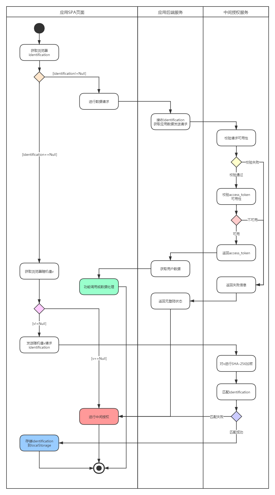
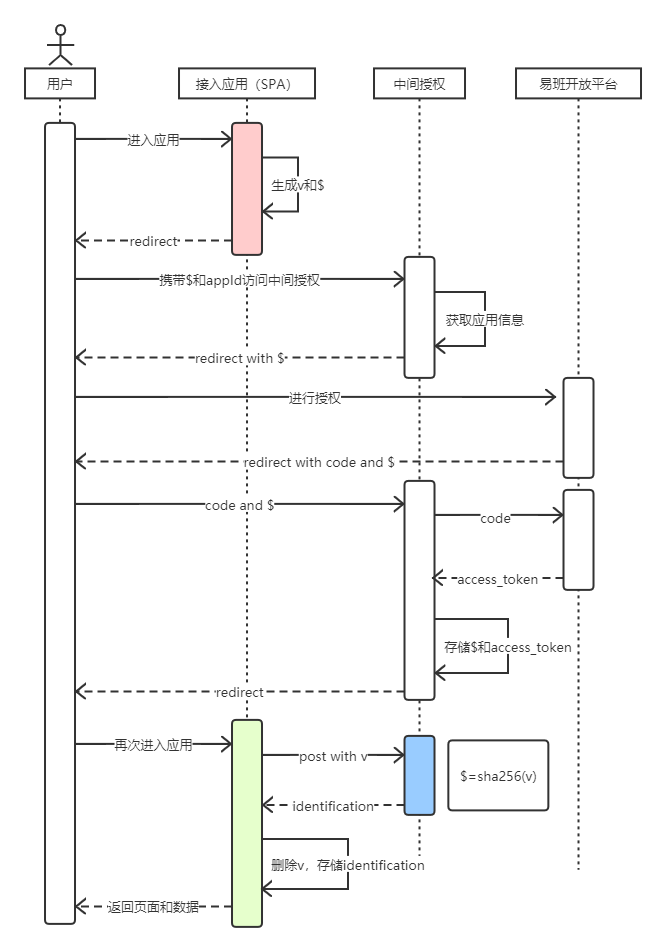

# middle-authorization-document

易班中间授权服务说明文档

本服务适用于同时符合以下两个要求的项目：
1. 前后端分离的项目，前后端分开部署。
2. 前端不中断部署，采用覆盖的方式更新应用。

### [相关知识](#相关知识)

**在使用本服务前你需要先了解易班接入应用的用户登陆流程，以及一些相关的知识**

我们假设你已经了解过以下相关内容：
- [OAuth 2.0](https://oauth.net/2/)
- [PKCE Flow](https://developer.okta.com/blog/2019/08/22/okta-authjs-pkce/?utm_campaign=text_website_all_multiple_dev_dev_oauth-pkce_null&utm_source=oauthio&utm_medium=cpc)
- [SHA-256](https://en.wikipedia.org/wiki/SHA-2)
- [易班开放平台](https://o.yiban.cn/)

### [易班登陆流程](#易班登陆流程)

1. 调用授权接口获取用户令牌（code，授权码）
   - 接口 URI：https://openapi.yiban.cn/oauth/authorize
   - 请求方式：GET 重定向
   - 参数 client_id = AppID
   - 参数 redirect_uri = 授权回调地址（站内应用填写站内地址）
   - 防跨站伪造参数 state
2. 易班授权服务器向回调地址进行响应
   - 响应参数 code = 授权码，有效期 300 秒
   - 防跨站伪造参数 state
3. 调用授权凭证接口获取授权凭证（access_token）
   - 接口 URI：https://openapi.yiban.cn/oauth/access_token
   - 请求方式：POST 请求（form-data 方式）
   - 参数 client_id = appID
   - 参数 client_secret = AppSecret
   - 参数 redirect_uri = 授权回调地址（站内应用填写站内地址）
   - 参数 code = 授权码

详见：[易班开放平台wiki文档授权机制说明](https://o.yiban.cn/wiki/index.php?page=%E6%8E%88%E6%9D%83%E6%9C%BA%E5%88%B6%E8%AF%B4%E6%98%8E)

每个应用获得同一用户的授权凭证独立，每个应用的接口调用数据相互独立，因此不同项目应分开在易班开放平台创建接入和进行审核

详见：[易班开放平台wiki文档权限说明](https://o.yiban.cn/wiki/index.php?page=%E6%9D%83%E9%99%90%E8%AF%B4%E6%98%8E)

### [本服务处理的问题](#本服务处理的问题)

在易班开放平台创建接入的应用，在开发时需要将回调地址修改为本地地址，而在生产环境中需要修改为服务地址。

应用部署到生产环境后，需要修改服务代码时，需要将应用设置为维护状态，修改回调地址，才能在本地修改代码。

学生可能直接使用链接进入应用，而不是在易班应用广场进入，导致无法跳转至维护地址，出现页面无法访问情况。

**本服务处理的问题**

- 统一一个线上服务处理不同应用的授权登陆（本地开发需联网），本地开发与生产环境使用同一回调地址，需要修改代码应用时不需要进入维护状态
- 可在本服务设置维护状态与维护地址，出现访问的应用为维护状态时，直接跳转到维护页面

### [使用方法与API](#使用方法与API)

在使用本服务之前你需要了解一下以下服务定义好的内容：

**identification**：用户登陆后获得的**标识码**，存储在浏览器的 localStorage 中

**随机值 v**：用于获取用户 identfication 的密钥原值

**密钥 $**：使用 SHA-256 加密随机值 v 获得的加密值，用于匹配用户随机值 v，检测请求可信性

[服务API与使用方法请参考仓库 middle-authorization-service](https://github.com/csxyyiban/middle-authorization-service)

### [登陆状态校验节点](#登陆状态校验节点)

使用本服务应当在进行授权之前，应当对用户的登陆状态进行校验，应用与服务状态校验节点共 5 个：
- 用户标识码检测
- 浏览器随机值检测
- access_token 请求可用性校验
- access_token 有效期校验
- identification 匹配

**用户标识码**是证明用户登陆状态最直接的方式，因此在用户进行功能操作时，都需要获取浏览器标识码来证明用户已登陆，并提供标识码用于后端业务换取 access_token 进行易班 API 请求。

当浏览器不存在标识码时，代表用户此时并不存在登陆状态，此时用户进入应用有两种状态：
1. 用户第一次进入应用
2. 用户进行授权后进入应用

在用户进行授权时，页面代码会生成随机值 v 并存储在浏览器 localStorage 中，因此 SPA 应用应当检查浏览器是否存在**随机值 v**，以识别用户当前进入应用页面的行为。

随机值 v 可用于换取用户标识码 identification，通常这和用户授权是连续的动作，因为在授权完将会重新前往应用页面，此时将发起请求获取 identfication。因此这出错的概率较小。

但这并不代表不会出错，对于 identification 的存储，在 Redis 中仅有 **1 分钟**，超过这个时间随机值 v 将无法换取到对应的 identification。

当用户出现授权后中断跳转操作或网络超时等原因，使得 1 分钟内没有换取到 identification 时，那么用户需要重新进行授权。因此 **identification 匹配**是中间授权服务的一个校验节点。

此外，当成功换取到用户标识码时，应当将浏览器中的随机值 v 清除，防止重复请求。

**注意：对于存在标识码的情况，并不能证明用户一定处于登陆状态**

localStorage 的存储时间是永久的，这将让用户看起来永远保持登陆状态，但我们并不清楚存储在 localStorage 中的 identification 什么时候会泄露出去。

因此在服务在存储 access_token 的时候，设置了有效期，一旦过了这个有效期，或是用户主动退出登陆，identification 将匹配不到 access_token，即 **identification 可用性**，这是**access_token 请求可用性校验**的一部分，处于本服务中。

对于 access_token 请求可用性校验，除了刚刚提到的 access_token 有效期外，还有 appId 与 appSecret 的匹配校验，这 3 个校验构成了 access_token 请求可用性校验。

对于成功获取的 access_token，在易班开放平台上依旧拥有有效时间限制，因此**access_token 可用性校验**也是中间授权服务的工作之一。

### [校验结果](#校验结果)

对于用户登陆状态的校验，其导致的结果应当有 3 种（如上面那个图所示）：
- 应用需要进行中间授权
- 完成授权存储 identification
- 应用成功进行用户功能调用或数据处理

*实际也可视为两种结果，因为在完成收取按存储 identification 后依旧需要进行用户数据获取和处理*

### [应用登陆校验和应用状态](#应用登陆校验和应用状态)

对于应用而言，需要进行的校验操作只有两个检测，即**用户标识码检测**和**浏览器随机值检测**。如果你使用的是 Vue-CLI 来构建你的 SPA 应用，那么你可用使用 UA-SPAapp-authorize-package 来进行自动检测和授权登陆，以减少你编写的代码。

对于不同的校验节点，都可能导致不同的校验结果，因此对于不同情况，整体的请求过程也不相同。上面用户登陆状态校验节点活动图中，4 个节点的检测结果都是对用户登陆状态进行作用，但省略了对应用状态的判断。

当应用处于维护状态或者下线时，用户使用功能或页面获取用户数据需要使用到 access_token，将会出现后端服务提供的接口响应 404，此时 SPA 界面应当理解后端服务已不可用，并进行相对应的提示。

但对于中间授权，并不依赖于应用后端服务，因此此时应用并不清楚后端服务的状态，或者用户保存了授权链接直接进行授权操作，这将绕过中间服务，这都会导致用户操作不符合应用状态，出现用户无法理解的错误。

因此中间会对授权或易班回调进行额外的状态检测，重定向至对应的状态地址；上线状态重定向至应用主页，维护状态重定向至应用设置的维护地址（如果没有设置则重定向至本服务提供的维护地址），下线状态重定向至本服务提供的 404 页面。

如果SPA页面发现应用后端服务不可用的情况下，希望了解到应用处于什么状态时，可调用[应用状态获取接口](https://github.com/csxyyiban/middle-authorization-service#%E5%BA%94%E7%94%A8API%E6%8E%A5%E5%8F%A3)来获取相关信息。

### [授权流程](#授权流程)

在授权过程中，如何将用户标识码安全可靠的给前端，是一个重点，在这里我们采用 PKCE Flow 来完成这一操作。

在应用准备进行发起授权时，应用先生成一随机值 v，并对 v 进行加密获得密钥 $，在重定向时将 $ 一种传给中间授权，此时 $ 暴露在外部，但 v 存储仅存储在用户浏览器中。

中间服务重定向至易班开放平台时，也带上这个 $，在用户完成授权，易班进行回调时，$ 会被一并传过来，中间服务通过回调获得的 code 换取到用户令牌 access_token，并生成 identification。

之后，中间服务将 identification 按照 $ 存储至 Redis，再将 access_token 按照 identification 存储至 Redis。此时，应用就可用使用 $ 来获取 identification，然后使用 identification 获取 access_token。

但此时，应用换取 identification 时，并不是传入 $ 作为请求参数，而是一开始生成的 v，中间服务接收到 v 时，会进行同样算法的加密，获得另一个密钥，此时匹配 Redis 中对应的密钥 $ 即可获得 identification。

因此，当忽略前面考虑的因素，在理想状态下，应用进行授权和获取用户令牌的应用与服务双方流程如下：
1. 应用生成随机值 v 和 $，存储 v 到浏览器 localStorage
2. 携带 $ 和 appId 重定向至中间授权
3. 中间授权重定向至易班开放平台
4. 用户进行登陆授权
5. 中间授权获取 code 换取 access_token，生成 identification
6. 中间授权存储 access_token 和 identification，重定向至应用
7. 应用携带 v 发送 POST 请求
8. 中间授权对 v 进行加密匹配 identification
9. 应用存储 identification 到 localStorage，删除浏览器中的 v

当应用需要使用 access_token 进行业务操作时：
1. 应用前端将 identification 传入后端
2. 应用后端发送 identification 和 AppSecret 换取 access_token
3. 应用使用 access_token 调用易班 API 完成业务

### 未来规划

- 应用错误记录、堆栈跟踪、处理
- 用户活跃数据统计

### 相关项目

中间授权服务：[middle-authorization-service](https://github.com/csxyyiban/middle-authorization-service)

middle-authorization应用授权JS包：[UAS-SPAapp-authorize-package](https://github.com/csxyyiban/UAS-SPAapp-authorize-package)

城院易班默认静态页面：[default-static-page](https://github.com/csxyyiban/default-static-page)
